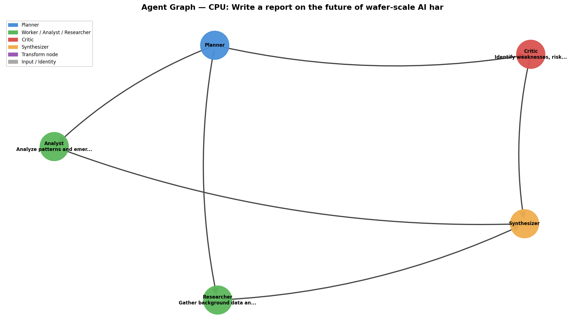

# declarative-parallel-dsl

> A declarative agentic workflow framework built with Grok API + Ray + reflection loops.

Autonomous agents that plan, execute in parallel, critique each other, and synthesize results — all described with the same high-level DSL regardless of backend (CPU, GPU, Ray, or future Cerebras WSE-3).



---

## Project Goals

- **Single DSL, multiple backends** — write once, run on CPU threads, GPU (Triton), distributed Ray clusters, or Cerebras CSL without changing your workflow code
- **Real agentic pipelines** — Planner → parallel specialist agents → reflection / critique loops → Synthesizer, all calling the real Grok API
- **Serious workloads** — agents process the full text of *Pride and Prejudice* (~750 kB) split across 4 parallel workers to demonstrate real throughput
- **Confidence-gated loops** — agents self-score their output (0.0–1.0 via JSON); reflection rounds continue only until average confidence crosses a threshold
- **Tool use** — agents receive keyword extraction and word-count results before calling the API, grounding their analysis in facts
- **Persistent memory** — optional `--debug` flag writes all round results to JSON + SQLite for inspection and replay
- **Visualization** — every workflow saves a PNG graph of its agent network

---

## Features

| Feature | Details |
|---------|---------|
| Same DSL for all backends | `ParallelDSL(backend="cpu" / "ray" / "gpu" / "csl")` |
| Real Grok API integration | `grok-3` via xAI's OpenAI-compatible endpoint |
| Parallel agents | 4 specialist agents run simultaneously via `dsl.map()` or Ray remote tasks |
| Reflection loops | Each agent critiques and rewrites its own prior output |
| Confidence gating | Loops stop early when avg agent confidence ≥ threshold |
| Tool use | Keyword extraction + word count injected into every agent prompt |
| Persistent memory | Ray actor stores results in-memory; `--debug` writes JSON + SQLite |
| Graph visualization | `networkx` + `matplotlib` PNG saved after every run |
| Interactive CLI | Natural-language command interface via `agent.py` |

---

## API Key Setup

Examples 06–08 require an [xAI Grok API key](https://console.x.ai). Example 05 needs nothing.

**The key is never in any Python file.** All code uses `os.getenv("XAI_API_KEY")` exclusively.

### On Replit
1. Click the **🔒 Secrets** tab in the left sidebar
2. **New Secret** → Name: `XAI_API_KEY` → Value: your key (starts with `xai-`)
3. Replit injects it automatically — no `.env` file needed

### Local / after cloning from GitHub
```bash
# create .env (already in .gitignore — never commit it)
echo "XAI_API_KEY=xai-your-key-here" > .env

# load for this session
export $(cat .env)
```
Get a key at: **https://console.x.ai** → sign in → **Create API Key**

---

## Installation

```bash
pip install -e .
pip install ray        # needed for examples 07, 08, 09, 10
pip install stim       # needed for examples 09, 10 (QEC simulation)
pip install matplotlib # needed for example 10 (noise curve plot)
```

---

## How to Run Each Example

All commands from the workspace root.

### Example 05 — CPU agents, no API key required
```bash
python3 examples/05_agentic_workflow.py
```
Pure Python parallel agents. A Planner decomposes a task, three workers (Researcher, Analyst, Critic) run in parallel via `ThreadPoolExecutor`, and a Synthesizer combines results. Graph saved to `examples/agent_graph_cpu.png`.

---

### Example 06 — Grok API + CPU backend
```bash
python3 examples/06_agentic_grok_workflow.py
```
Downloads *Pride and Prejudice* (~750 kB), splits it into 4 chunks, and runs 4 specialist agents in parallel against the real Grok API. A Synthesizer writes a literary analysis report. Runtime ~15–20 s. Graph saved to `examples/agent_graph_grok_cpu.png`.

---

### Example 07 — Grok API + Ray + reflection loops
```bash
python3 examples/07_agentic_grok_ray_reflection.py
```
Same as 06 but Ray distributes agents across CPU cores. A second reflection round has each agent critique its own prior output. Ray warnings are suppressed automatically. Runtime ~30–40 s. Graph saved to `examples/agent_graph_grok_ray.png`.

---

### Example 08 — Confidence-gated reflection + tool use + memory
```bash
# default: in-memory only, no files written
python3 examples/08_confidence_tools_memory.py

# --debug: also writes JSON + SQLite after every round
python3 examples/08_confidence_tools_memory.py --debug
```
Most advanced workflow. Key parameters at the top of the file:

| Parameter | Default | Meaning |
|-----------|---------|---------|
| `CONFIDENCE_THRESHOLD` | `0.88` | Stop reflection early when avg confidence reaches this |
| `MAX_ROUNDS` | `4` | Hard cap on rounds regardless of confidence |

Agents receive keyword extraction + word count tool results before calling Grok, return structured JSON (`analysis`, `confidence`, `gaps`), and the loop stops as soon as the average crosses the threshold. Runtime ~20–50 s depending on rounds. Graph saved to `examples/agent_graph_confidence.png`.

With `--debug`, two extra files are written to `examples/`:
- `memory_store.json` — full store, all rounds, human-readable
- `memory_store.db` — SQLite, one row per agent per round

Query the database:
```bash
python3 -c "
import sqlite3
con = sqlite3.connect('examples/memory_store.db')
for r in con.execute('SELECT round_key, agent, confidence FROM agent_results'):
    print(r)
"
```

---

### Example 10 — Adaptive QEC noise sweep (dynamic loop + plot)
```bash
python3 examples/10_qec_adaptive_loop.py
```
A **Grok navigator agent** drives the experiment: after each Stim measurement it decides which noise level to probe next (filling gaps, hunting the threshold region) until it is confident the curve is well-characterised or a round cap is hit.

What happens step by step:
1. **Seed** — one Stim measurement at noise=0.02 (no API call)
2. **Adaptive loop** — each round: Navigator (Grok) sees all data, picks the next noise value, Stim runs it; loop stops when `confidence >= 0.85` or 8 rounds
3. **Plot** — log-log error rate vs noise PNG with measured points, annotation order, and theoretical 3p² reference line → `examples/qec_noise_curve.png`
4. **Agent graph** → `examples/agent_graph_qec_adaptive.png`
5. **Synthesizer** — Grok writes a final report identifying the failure threshold and top recommendation

Results saved to `examples/qec_adaptive_results.json`. Runtime ~30–60 s.

Requires `pip install stim matplotlib`.

---

### Example 09 — Quantum Error Correction simulation (Stim + Ray + Grok)
```bash
python3 examples/09_qec_agentic_simulation.py
```
Runs a **noise-sweep experiment** on a 3-qubit bit-flip repetition code using [Stim](https://github.com/quantumlib/Stim). Four Ray agents each simulate a different noise level (0.5 %, 1 %, 2 %, 4 %), call Grok for scientific analysis, then critique each other in a reflection round. A Synthesizer writes a final scientific report.

What happens step by step:
1. **Planner** — Grok designs the experiment
2. **Local sanity check** — Stim runs all 4 noise levels locally and prints raw error rates before any API call
3. **Parallel agents** — 4 Ray agents each run their own Stim circuit and call Grok for analysis
4. **Reflection** — each agent critiques prior results and suggests improvements
5. **Graph** saved to `examples/agent_graph_qec.png`
6. **Synthesizer** writes the final report with concrete recommendations

Results always saved to `examples/qec_results.json`. Runtime ~40–60 s.

Expected noise-scaling output (confirms the code suppresses single-qubit errors as ~noise²):
```
noise=0.005  →  logical_error_rate=0.00010
noise=0.010  →  logical_error_rate=0.00030
noise=0.020  →  logical_error_rate=0.00140
noise=0.040  →  logical_error_rate=0.00560
```

Requires `pip install stim`.

---

### Interactive CLI
```bash
python3 agent.py
```
Natural-language interface. Type commands like `run cpu`, `run ray`, or `visualize`.

---

## Agentic Workflow Pattern

```
          ┌─────────┐
          │ Planner │
          └────┬────┘
    ┌──────────┼──────────┬──────────┐
    ▼          ▼          ▼          ▼
Researcher  Analyst    Critic   Historian   ← parallel, real Grok API
    │          │          │          │
    └──────────┼──────────┴──────────┘
               │  reflection round (if confidence < threshold)
    ┌──────────┼──────────┬──────────┐
    ▼          ▼          ▼          ▼
  R_R2       A_R2      C_R2      H_R2       ← agents improve own output
    └──────────┼──────────┴──────────┘
          ┌────┴──────┐
          │Synthesizer│
          └───────────┘
```

---

## Backends

| Backend | Status | Requires |
|---------|--------|---------|
| CPU | ✅ Always available | Nothing |
| GPU (Triton) | ✅ With CUDA | `pip install torch triton` |
| Ray distributed | ✅ Available | `pip install ray` |
| Cerebras CSL | 🔧 Stub / sketch | Cerebras SDK + WSE-3 |

---

## Project Structure

```
declarative-parallel-dsl/
├── dsl/
│   ├── base_dsl.py              # ParallelDSL class, backend dispatch
│   ├── dataflow_dsl.py          # Dataflow graph DSL
│   ├── graph_planner.py         # networkx task graph planner
│   ├── visualizer.py            # matplotlib PNG renderer
│   └── backends/
│       ├── cpu_backend.py       # ThreadPoolExecutor
│       ├── gpu_backend.py       # Triton kernel (falls back to CPU)
│       ├── ray_backend.py       # Ray remote tasks (falls back to CPU)
│       └── cerebras_csl.py      # CSL skeleton generator
├── examples/
│   ├── 01_simple_map.py
│   ├── 02_dataflow_pipeline.py
│   ├── 03_triton_gpu_kernel.py
│   ├── 04_ray_distributed.py
│   ├── 05_agentic_workflow.py           # CPU, no API
│   ├── 06_agentic_grok_workflow.py      # Grok + CPU
│   ├── 07_agentic_grok_ray_reflection.py  # Grok + Ray + reflection
│   ├── 08_confidence_tools_memory.py    # Confidence-gated + tools + memory
│   ├── 09_qec_agentic_simulation.py     # QEC — Stim + Ray + Grok
│   ├── 10_qec_adaptive_loop.py          # Adaptive loop + noise curve plot
│   └── agent_graph_cpu.png              # sample visualization
├── agent.py                     # natural-language CLI
├── instructions-agent-grok-ray.md
├── setup.py
├── LICENSE
└── README.md
```

---

## Security Notes

- `XAI_API_KEY` is read only from environment variables — never from files or code
- `.env` is in `.gitignore` — never commit it
- No credentials, tokens, or secrets appear anywhere in the source tree
- Ray CPU warnings are suppressed via env vars set in code, not via any secret

---

## License

MIT — see [LICENSE](LICENSE)
